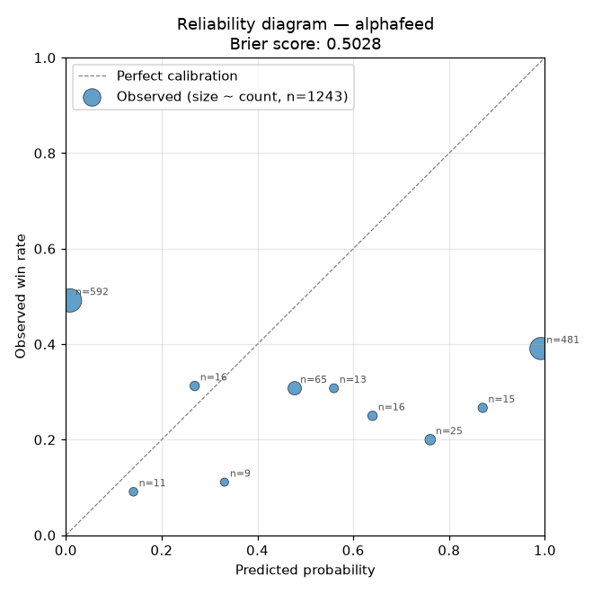
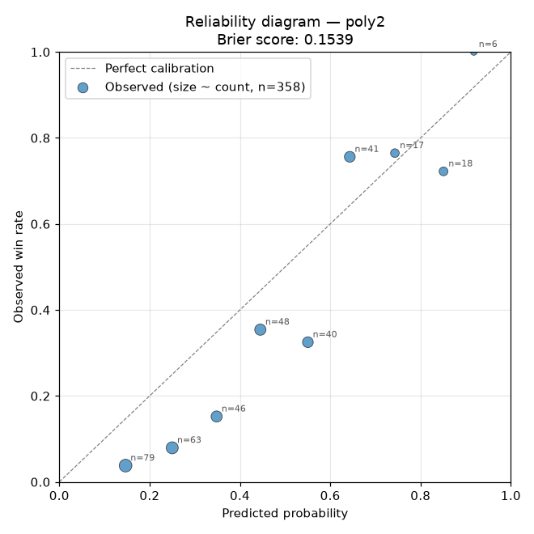

# Calibration report — alphafeed + poly2

Do the models' stated probabilities match observed win rates? Reads
`signal_tracker.db`, bins resolved signals by predicted probability
into 10 deciles, and compares each bin's observed win rate against
what the model claimed.

A well-calibrated model has bins that hug the diagonal in the plots
below — predicting 0.65 means the market actually wins 65% of the
time. Deviations tell you whether the model is overconfident,
underconfident, or noisy.

The Brier score summarises the whole distribution in one number:
0 = perfect, 0.25 = uninformed coin flip, 1 = perfectly wrong.
Anything below 0.20 combined with bins near the diagonal is
production-usable.

## alphafeed

- **N:** 1,243 resolved signals with `estimated_prob` populated
- **Brier score:** **0.5028** (0 = perfect, 0.25 = uninformed 50/50, 1 = perfectly wrong)

**Verdict:** Noisy calibration. Brier 0.503. Per-bin bias is inconsistent (weighted gap -0.04), so a simple linear correction won't fix it — needs a re-trained model or a richer calibrator (isotonic regression).

| Bin | Count | Mean predicted | Observed win rate | Gap (obs − pred) |
|---|---|---|---|---|
| 0.05 | 592 | 0.009 | 0.492 | +0.483 |
| 0.15 | 11 | 0.141 | 0.091 | -0.050 |
| 0.25 | 16 | 0.269 | 0.312 | +0.044 |
| 0.35 | 9 | 0.331 | 0.111 | -0.220 |
| 0.45 | 65 | 0.478 | 0.308 | -0.170 |
| 0.55 | 13 | 0.560 | 0.308 | -0.252 |
| 0.65 | 16 | 0.640 | 0.250 | -0.390 |
| 0.75 | 25 | 0.761 | 0.200 | -0.561 |
| 0.85 | 15 | 0.870 | 0.267 | -0.604 |
| 0.95 | 481 | 0.992 | 0.391 | -0.601 |

## poly2

- **N:** 358 resolved signals with `estimated_prob` populated
- **Brier score:** **0.1539** (0 = perfect, 0.25 = uninformed 50/50, 1 = perfectly wrong)

**Verdict:** Noisy calibration. Brier 0.154. Per-bin bias is inconsistent (weighted gap -0.11), so a simple linear correction won't fix it — needs a re-trained model or a richer calibrator (isotonic regression).

| Bin | Count | Mean predicted | Observed win rate | Gap (obs − pred) |
|---|---|---|---|---|
| 0.15 | 79 | 0.147 | 0.038 | -0.109 |
| 0.25 | 63 | 0.250 | 0.079 | -0.171 |
| 0.35 | 46 | 0.348 | 0.152 | -0.196 |
| 0.45 | 48 | 0.445 | 0.354 | -0.091 |
| 0.55 | 40 | 0.550 | 0.325 | -0.225 |
| 0.65 | 41 | 0.643 | 0.756 | +0.113 |
| 0.75 | 17 | 0.743 | 0.765 | +0.022 |
| 0.85 | 18 | 0.851 | 0.722 | -0.129 |
| 0.95 | 6 | 0.918 | 1.000 | +0.082 |

## Systems not covered

- **poly**: signals have `estimated_prob = NULL` — its logger never
  populated the field. Needs a fix at the poly logger site before
  calibration can be measured.
- **modeltelegra** per-ticker segments: all currently under 30
  resolved bets — sample too small for a decile-level reliability
  diagram.
